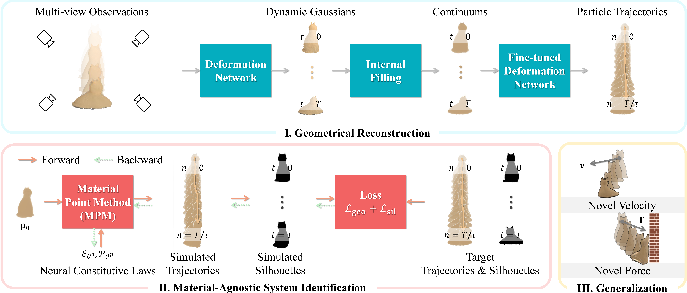

# MASIV

> **Toward Material-Agnostic System Identification from Videos**
> 
> ICCV 2025
> 
> [Yizhou Zhao](https://scholar.google.com/citations?user=nVKRaf4AAAAJ&hl=en)<sup>1</sup>, [Haoyu Chen](https://tonychen050400.github.io/)<sup>1</sup>, [Chunjiang Liu](https://chunjiangliu.com/)<sup>1</sup>, [Zhenyang Li](https://scholar.google.com/citations?hl=en&user=r9f4mLMAAAAJ)<sup>2</sup>, [Charles Herrmann](https://scholar.google.com/citations?user=LQvi5XAAAAAJ&hl=en)<sup>3</sup>, [Junhwa Hur](https://hurjunhwa.github.io/)<sup>3</sup>, [Yinxiao Li](https://scholar.google.com/citations?user=kZsIU74AAAAJ&hl=en)<sup>3</sup>, [Ming‑Hsuan Yang](https://scholar.google.com/citations?user=p9-ohHsAAAAJ&hl=en)<sup>4</sup>, [Bhiksha Raj](https://scholar.google.com/citations?user=IWcGY98AAAAJ&hl=en)<sup>1</sup>, [Min Xu](https://scholar.google.com/citations?user=Y3Cqt0cAAAAJ&hl=en)<sup>1*</sup>
> 
> <sup>1</sup>Carnegie Mellon University  <sup>2</sup>University of Alabama at Birmingham  <sup>3</sup>Google  <sup>4</sup>UC Merced

[](https://arxiv.org/abs/2508.01112)
[](https://huggingface.co/datasets/yizhouz/MASIV)



MASIV determines object geometry and governing physical laws from videos in a material-agnostic manner.

## TODO

- [x] Code release
- [x] MASIV Multi-Sequence Dataset release

## Environment

We test our code on `Ubuntu 22.04`, `CUDA Toolkit 12.4`, `NVIDIA A100 80G`.

```bash
git https://github.com/Skaldak/gic/tree/refactor/cleanup
cd masiv

conda env create --file environment.yml
conda activate masiv
```

## Dataset

### Benchmark

We validated our algorithm using the [PAC-NeRF dataset](https://ucla.app.box.com/s/039jwttn9ibac73h3kit5vsuiepy7j4y) and the [Spring-Gaus dataset](https://drive.google.com/drive/folders/1SN4vrPZSuBnbkDTLl0nu9g-boVUr5yO1).
The structure of the dataset and model files is as follows:

```
├── dataset
│   | PAC-NeRF-Data
│       | data
│           ├── bird
│           ├── cat
│           ├── ...
│   | Spring-Gaus
│       | mpm_synthetic
│           | render
│               ├── apple
│               ├── cream
│               ├── ...
│       | real_capture
│           ├── bun
│           ├── burger
│           ├── ...
│   | Genesis
│       | multi_sequence
│
```
### MASIV Multi-Sequence Dataset

We introduce a novel high-quality multi-view and multi-sequence dataset built on [Genesis](https://github.com/Genesis-Embodied-AI/Genesis).
The dataset features multi-view and multi-sequence recordings, capturing diverse material behaviors across 10 object geometries and 5 material types. 
Each combination is recorded from multiple synchronized camera viewpoints, providing coverage for both dynamic reconstruction and material identification learning.
Our data is available on [Hugging Face](https://huggingface.co/datasets/CMURI/MASIV).

## Evaluation

### Preprocessing

If you're running for the first time, preprocess the dataset by segmenting foreground from background with:

```
python prepare_pacnerf_data.py --data_folder=PAC-NeRF-Data/data/*
```

We used the same [segmentation model](https://ucla.app.box.com/s/039jwttn9ibac73h3kit5vsuiepy7j4y) as PAC-NeRF for segmentation.

### Training

#### General Command

```
python train_dynamic.py --config_path ${CONFIG_FILE} -source_path ${DATA_DIR} -model_path ${MODEL_DIR} 
```

#### Command line arguments 

- `-c, --config_path` config file path
- `-s, --source_path` data path
- `-m, --model_path` model path

Optional:

- `--reg_scale` enabling regularization on Gaussian scaling parameters
- `--reg_alpha` enabling regularization on rendered opacity parameter
- `env.pretrain` setting pretrained nclaw model, e.g. `env.pretrain=jelly`
- `sim.center sim.size` setting simulation area, e.g. `sim.center=2.0 sim.size=4.0`

#### Example Commands on PAC-NeRF, Spring-Gaus Synthetic, Spring-Gaus Real, Mulit-Series Dataset

```
python train_dynamic.py --config_path config/pacnerf/elastic/default.yaml --source_path data/PAC-NeRF-Data/data/elastic/0 --model_path output/pacnerf/elastic/0 --reg_scale --reg_alpha env.pretrain=jelly sim.center=2.0 sim.size=4.0
```

```
python train_dynamic.py --config_path config/spring_gaus/benchmark/apple.yaml --source_path data/Spring-Gaus/mpm_synthetic/render/apple --model_path output/spring_gaus/benchmark/apple --reg_scale --reg_alpha env.pretrain=plasticine sim.center=1.5 sim.size=4.0
```

```
python train_dynamic.py --config_path config/spring_gaus/real_capture/bun.yaml --source_path data/Spring-Gaus/real_capture/bun --model_path output/spring_gaus/real_capture/bun --reg_scale --reg_alpha --reg_init env.pretrain=plasticine meta.w_velo=0.1 meta.w_traj=1.0
```

```
python train_dynamic.py --config_path config/genesis/multi_sequence/default.yaml --source_path data/Genesis/multi_sequence/0_0 --model_path output/genesis/multi_sequence/0_0 --reg_scale --reg_alpha env.pretrain=plasticine sim.center=1.0 sim.size=2.0 
```

Use `--model_path` to specify the directory where the trained model and intermediate states will be saved.

### Prediction

After training, you may do future state prediction and evaluation with this command:

```
python predict.py --config_path config/pacnerf/{material}/default.yaml --source_path data/PAC-NeRF-Data/data/{material}/{num_id} --model_path output/pacnerf/{material}/{num_id} --gt_path data/PAC-NeRF-Data/simulation_data/{material}/{num_id} --reg_scale --reg_alpha env.pretrain=jelly sim.center=2.0 sim.size=4.0 --load_iter 1000 --iteration 40000
```

## Extra Features

### Batch Training

```
torchrun --nproc-per-node=8 run.py train_dynamic --config_path config/pacnerf --source_path data/PAC-NeRF-Data/data --model_path output/PAC-NeRF-Output --gt_path data/PAC-NeRF-Data/simulation_data --reg_scale --reg_alpha env.pretrain=jelly sim.center=2.0 sim.size=4.0 --subfolder
```

### Generalization

To show that our model is capable of robustly generalizing to novel conditions, we provide this script, where novel material properties, varied initial velocities, and different external force fields could be specified to the trained model.

```
python generalize.py --config_path config/pacnerf/{material}.yaml --source_path data/PAC-NeRF-Data/data/{material} --model_path output/pacnerf/{material} --novel_material output/pacnerf/{novel_material} --novel_gravity -5.0, -2.5, 0.0 --novel_velocity 1.0, 0.5, 0.0 --reg_scale --reg_alpha env.pretrain=jelly sim.center=2.0 sim.size=4.0 --load_iter 1000
```

Arguments:

- `--novel_material`: setting novel material
- `--novel_gravity`: setting novel gravity magnitude and direction
- `--novel_velocity`: setting novel initial velocity

### Visualization

This script opens an Open3D window showing model’s trajectory lines:

```
python visualize.py --split train --config_path config/pacnerf/{material}.yaml --source_path data/PAC-NeRF-Data/data/{material} --model_path output/pacnerf/{material} --trajectory mpm sim.center=2.0 sim.size=4.0
```

Arguments:

- `--split`: `train` or `test`
- `--trajectory`: setting visualization mode (`deformable` for Gaussian reconstruction and `mpm` for MPM simulation)

## Acknowledgments

We sincerely thank the authors of [Dynamic 3D Gaussians](https://dynamic3dgaussians.github.io/), [PAC-NeRF](https://xuan-li.github.io/PAC-NeRF/), [Spring-Gaus](https://zlicheng.com/spring_gaus/), and [GIC](https://jukgei.github.io/project/gic/) whose codes and datasets were used in our work.

## Citing MASIV

If you find this project helpful for your research, please consider citing the following BibTeX entry:

```
@article{zhao2025masiv,
  title={MASIV: Toward Material-Agnostic System Identification from Videos},
  author={Zhao, Yizhou and Chen, Haoyu and Liu, Chunjiang and Li, Zhenyang and Herrmann, Charles and Hur, Junhwa and Li, Yinxiao and Yang, Ming-Hsuan and Raj, Bhiksha and Xu, Min},
  journal={arXiv preprint arXiv:2508.01112},
  year={2025}
}
```